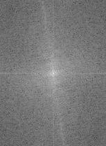
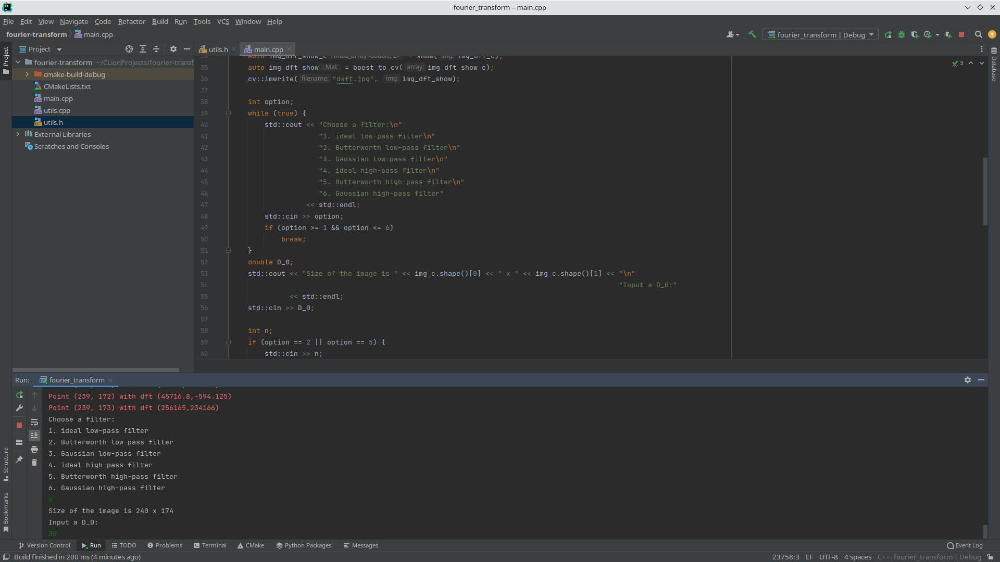
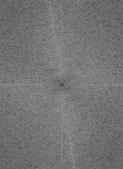
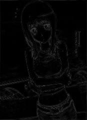

<meta charset="UTF-8">

# 作业一

## 编译

依赖 [Boost](https://www.boost.org) 和 [OpenCV](https://www.opencv.org) 库。

C++ 版本不低于 14。

使用 [CMake](https://www.cmake.org) 编译。

## 运行

### 源文件准备

在运行目录下准备好 origin.jpg 文件作为源文件，运行 [fourier_transform](cmake-build-debug/fourier_transform) 程序。

### 傅里叶变换

傅里叶变换时未采用快速算法，较慢。 [stderr](/dev/stderr) 会输出当前计算的像素点。

变换完成后，生成 dsft.jpg 文件。

### 滤波

变换完成后，选择滤波器：

然后输入 $D_0$ 的值。

如果是 Butterworth 滤波，还需输入 $n$ 。

滤波完成后，生成 dsft-new.jpg 文件。

### 逆变换

傅里叶逆变换时未采用快速算法，较慢。 [stderr](/dev/stderr) 会输出当前计算的像素点。

变换完成后，生成 idsft.jpg 文件。

